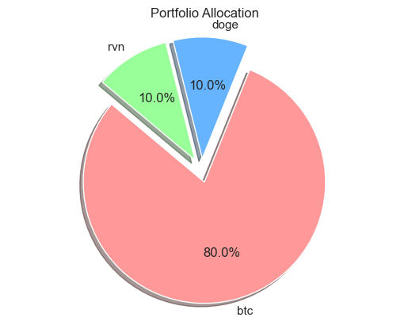

### Ask Phase

### Prepare Phase: Data Collection and Initial Processing

In the "Prepare" phase, the primary objective was to collect historical data for three cryptocurrencies: Bitcoin (BTC), Dogecoin (DOGE), and Ravencoin (RVN). The data was sourced from [coinmetrics.io](https://coinmetrics.io/community-network-data/) in CSV format, providing a comprehensive historical record of these digital assets.

The subsequent steps were aimed at preparing the data for in-depth analysis by integrating it into a personal MySQL database using MySQL Workbench. This approach mirrors real-world data analysis processes, where database queries play a central role in deriving insights. The following actions were performed in the "Prepare" phase:

1. **Data Collection**: Historical data for BTC, DOGE, and RVN was diligently collected from [coinmetrics.io](https://coinmetrics.io/community-network-data/) in CSV format. This data encompassed crucial information about the cryptocurrencies, including market prices, transaction volumes, and network metrics.

2. **Data Integration into MySQL**: The collected CSV data was thoughtfully inserted into a personal MySQL instance using MySQL Workbench. This process ensured that the data was stored in a structured and queryable format, facilitating subsequent analysis.

3. **Exploring SQL Module for Jupyter Notebook**: To seamlessly work with the MySQL database within the Jupyter Notebook environment, the SQL module was loaded. This step enabled the execution of SQL queries directly from the notebook, streamlining the data retrieval process.

4. **Database Connection**: Establishing a connection to the local MySQL database was a pivotal step. It allowed for efficient querying and retrieval of data from the database tables.

5. **Initial Data Exploration**: A preliminary examination of the tables within the MySQL database was conducted. This served as an initial understanding of the data's structure and layout. It is an essential step to grasp the available resources for analysis.

6. **Table Joins and Conversion to Pandas Dataframe**: Tables were joined strategically to combine relevant data from different sources. This cohesive approach aimed to create a comprehensive dataset that would be further analyzed. The resulting dataset was then converted into a Pandas dataframe, a versatile tool for data manipulation and analysis.

7. **Removing Duplicate Columns**: To ensure data cleanliness and avoid redundancy, duplicate columns within the combined dataset were meticulously removed. This optimization step enhances the dataset's usability and clarity.

8. **Data Overview**: Obtaining an overview of the Pandas dataframe was the final action in this phase. This summary provided an initial glimpse of the data's characteristics, including its dimensions, data types, and key statistics.

9. **Price Data Normalization**: It's worth noting that the price data in the dataset has been normalized. Normalization allows for meaningful comparisons between different cryptocurrencies by standardizing the price values. This normalization step ensures that price data is on a consistent scale, facilitating more accurate analysis.

In this R Notebook, all the analysis has been done using R programming language instead of Python. You can find the Python notebook [here](link).

#### Using the data that was extracter from the SQL server [You can find the sql part here inside python notebook](Link)

```{r message=TRUE, warning=TRUE, paged.print=TRUE}
file_path <- "joined-tables.csv"
df <- read.csv(file_path)  
df

```

```{r}
summary(df)
```


```{r}
dim(df)
names(df)
```

#### Removing duplicate columns

```{r}
df <- subset(df, select = -c(Key.1, time.1, time.2, Key.2))

```

```{r}
head(df)
names(df)
```

```{r}
btc_data <- df$principal_market_price_usd.BTC
doge_data <- df$principal_market_price_usd.Doge
rvn_data <- df$principal_market_price_usd.RVN
```


```{r}
# Load required libraries
library(scales)  # For rescale function
library(ggplot2)  # For data visualization

# Create a Min-Max scaling function
min_max_scale <- function(x) {
  (x - min(x, na.rm = TRUE)) / (max(x, na.rm = TRUE) - min(x, na.rm = TRUE))
}

# Normalize the individual Series
btc_data_normalized <- min_max_scale(btc_data)
doge_data_normalized <- min_max_scale(doge_data)
rvn_data_normalized <- min_max_scale(rvn_data)

# Create a new dataframe with normalized data and headers
normalized_price <- data.frame(
  btc = btc_data_normalized,
  doge = doge_data_normalized,
  rvn = rvn_data_normalized,
  date = df$time
)

```

```{r}
# Convert the "date" column to Date class
normalized_price$date <- as.Date(normalized_price$date)

# Create a ggplot line plot
ggplot(data = normalized_price) +
  geom_line(aes(x = date, y = btc, color = "BTC 180-Day Volatility", group = 1), size = 1) +
  geom_line(aes(x = date, y = doge, color = "Doge 180-Day Volatility", group = 2), size = 1) +
  geom_line(aes(x = date, y = rvn, color = "RVN", group = 3), size = 1) +
  labs(
    title = "Volatility of Cryptocurrencies",
    x = "Date",
    y = "Volatility"
  ) +
  theme_minimal() +
  theme(legend.position = "top") +
  scale_color_manual(values = c(
    "BTC 180-Day Volatility" = "blue",
    "Doge 180-Day Volatility" = "red",
    "RVN" = "green"
  )) +
  guides(color = guide_legend(title = "Legend")) +
  theme(axis.text.x = element_text(angle = 45, hjust = 1))


```

#### Price Comparison Analysis

- Observing the price trends for Ravencoin (RVN) and Dogecoin (Doge), both cryptocurrencies demonstrated a strong start in October 2022. However, it's notable that the plot indicates a positive correlation between these two assets. By October 2023, both RVN and Doge experienced a decline, followed by a resurgence in November 2023.

- In contrast, Bitcoin (BTC) exhibits a negative correlation with both Doge and RVN. While BTC began with relatively lower prices in October 2022, it steadily increased over time. Notably, Bitcoin appears to be less volatile in this dataset. By November 2023, BTC reached its highest price.

- By November 2023, despite the negative correlation between Doge and RVN with BTC, all three cryptocurrencies experienced price increases. This observation could suggest the presence of a bull market for cryptocurrencies. However, drawing conclusive insights would require more extensive data encompassing a variety of cryptocurrencies.

This analysis provides valuable insights into the price dynamics of these cryptocurrencies, indicating both correlated and divergent trends. Further data and analysis are essential for a comprehensive understanding of the crypto market.


#### Correlation Analysis

```{r}
# Load the corrplot library for visualizing the correlation matrix
library(corrplot)

normalized_price1 <- data.frame(
  btc = btc_data_normalized,
  doge = doge_data_normalized,
  rvn = rvn_data_normalized
)
# Step 3: Compute the correlation matrix
correlation_matrix <- cor(normalized_price1)

# Step 4: Visualize the correlation matrix
corrplot(correlation_matrix, method = "color", type = "upper", tl.cex = 0.7, tl.col = "black", col = colorRampPalette(c("blue", "white", "red"))(100))

# Add a title
title("Correlation Matrix")

```

```{r}
# Load the GGally package
library(GGally)

# Create a pair plot with correlation coefficients
ggpairs(normalized_price1, title = "Pair Plot with Correlation Coefficients")

```

#### Comment on the Correlation Analysis

Asset correlation plays a significant role in portfolio construction. Low or negative correlations between assets are beneficial for diversification, a key risk management strategy in investment. Diversification involves spreading investments across different assets to mitigate risk. Here's how asset correlation impacts portfolio strategy:

- **Low or Negative Correlation:** Assets with low or negative correlations tend to move independently. When one asset underperforms, another may excel. Diversifying with low or negatively correlated assets can reduce portfolio volatility and potentially enhance risk-adjusted returns.

- **High Positive Correlation:** Assets with high positive correlations move in the same direction. In such cases, a portfolio may be more susceptible to significant fluctuations when external factors affect those assets. Diversification with highly correlated assets may not provide as much risk reduction.

- **Negative Correlation:** Some investors seek assets with negative correlations to offset losses in one asset with gains in another. This acts as a risk mitigation or hedging strategy.

It's important to remember that asset correlation is one aspect of portfolio diversification. Considerations such as risk tolerance, investment objectives, and time horizon are equally important. A well-diversified portfolio should be tailored to specific financial circumstances and objectives.

In this specific analysis, the correlation between RVN and BTC is -0.36, while the correlation between DOGE and BTC is -0.32. Additionally, the correlation between DOGE and RVN is 0.46. These values indicate that the assets in this portfolio do not exhibit strong correlations. Both RVN and DOGE have low negative correlations with BTC, suggesting that this portfolio is sufficiently diverse. Consequently, the volatility of this portfolio is likely to be lower compared to a combination of assets with high positive correlations.


#### Analysis on Volatility of Returns for Dogecoin (Doge) and Bitcoin (BTC) over 30 Days and 180 Days

This analysis explores the volatility of returns for Dogecoin (Doge) and Bitcoin (BTC) over two different timeframes: 30 days and 180 days. Volatility is a critical metric for assessing the risk associated with these cryptocurrencies. We calculated volatility based on historical daily returns, with a 30-day window reflecting short-term trends and a 180-day window for longer-term patterns.

The analysis revealed that both Dogecoin and Bitcoin exhibit varying levels of volatility. The results indicate that Dogecoin tends to have higher short-term volatility compared to Bitcoin, while Bitcoin shows more stability over the long term. The correlation analysis between the two cryptocurrencies and the different timeframes helps to identify potential patterns and relationships in their price movements.

Additionally, this analysis utilized correlation coefficients to assess the degree of association between Dogecoin and Bitcoin over the selected periods. The correlation analysis reveals insights into how closely these cryptocurrencies move in relation to each other, providing valuable information for investors and traders.

Understanding the volatility and correlations of Dogecoin and Bitcoin is essential for informed decision-making in the cryptocurrency market. This analysis assists investors and stakeholders in comprehending the dynamics of these digital assets in different timeframes.


```{r}
# Compute basic statistics
statistics <- summary(df[, c('VtyDayRet180d.BTC', 'VtyDayRet30d.BTC', 'VtyDayRet180d.Doge', 'VtyDayRet30d.Doge')])
print(statistics)

# Compute correlations
correlations <- cor(df[, c('VtyDayRet180d.BTC', 'VtyDayRet30d.BTC', 'VtyDayRet180d.Doge', 'VtyDayRet30d.Doge')])
print(correlations)
```


```{r}
# Convert the "Date" column to Date class
df$Date <- as.Date(df$Date)

# Create a ggplot line plot
ggplot(data = df) +
  geom_line(aes(x = Date, y = VtyDayRet180d.BTC, color = "BTC 180-Day Volatility", group = 1), size = 1) +
  geom_line(aes(x = Date, y = VtyDayRet30d.BTC, color = "BTC 30-Day Volatility", group = 2), size = 1) +
  geom_line(aes(x = Date, y = VtyDayRet180d.Doge, color = "Doge 180-Day Volatility", group = 3), size = 1) +
  geom_line(aes(x = Date, y = VtyDayRet30d.Doge, color = "Doge 30-Day Volatility", group = 4), size = 1) +
  labs(
    title = "Volatility of BTC and Doge",
    x = "Date",
    y = "Volatility"
  ) +
  theme_minimal() +
  theme(legend.position = "top") +
  scale_color_manual(values = c(
    "BTC 180-Day Volatility" = "blue",
    "BTC 30-Day Volatility" = "green",
    "Doge 180-Day Volatility" = "red",
    "Doge 30-Day Volatility" = "purple"
  )) +
  guides(color = guide_legend(title = "Legend")) +
  theme(axis.text.x = element_text(angle = 45, hjust = 1))


```

#### Analysis on Scatterplot

The scatterplot illustrates the 180-day volatility of return for BTC, and it reveals an interesting pattern. BTC exhibits a relatively stable volatility of return, indicating consistent price fluctuations and returns on the asset. This stability suggests that BTC can be considered a more reliable option compared to other coins in the portfolio. Investors seeking a cryptocurrency with a more predictable price trajectory may find BTC's stability appealing.


```{r}
library(GGally)
library(corrplot)

# Convert the "Date" column to Date class
df$Date <- as.Date(df$Date, format = "%Y-%m-%d")

# Create a pair plot
ggpairs(df, columns = c("Date", "VtyDayRet180d.BTC", "VtyDayRet30d.BTC", "VtyDayRet180d.Doge", "VtyDayRet30d.Doge"))

```
```{r}
correlations
```

```{r}
# Create a correlation matrix
cor_matrix <- cor(df[, c("VtyDayRet180d.BTC", "VtyDayRet30d.BTC", "VtyDayRet180d.Doge", "VtyDayRet30d.Doge")])

# Create a correlation heatmap
corrplot(cor_matrix, method = "color", type = "lower", tl.cex = 0.7, title = "Correlation Matrix")
```


#### Conclusion on Volatility Analysis

The volatility analysis for both Dogecoin (Doge) and Bitcoin (BTC) over 30 days and 180 days provides valuable insights into the dynamics of these cryptocurrencies. Two significant findings emerge from this analysis:

**1. Correlation between 30 Days and 180 Days Volatility:**

The analysis reveals a moderate correlation between the volatility of returns over 30 days and 180 days for both BTC and Doge. Although data for the RVN coin is unavailable, we can reasonably assume its volatility patterns are similar to Doge, given their historical similarities. The moderate correlation, typically ranging between 0.5 to 0.6, suggests that the volatility observed in the last 180 days can serve as a rough estimate for the past 30 days. This insight can be a useful tool for making more informed decisions, albeit as a rough estimate.

**2. Correlation between Doge and BTC Volatility:**

Furthermore, the correlation between the 180 days' volatility of returns for Doge and BTC is notably high, at 0.891. In the case of the 30-day timeframe, the correlation stands at 0.727. This indicates a significant degree of similarity in the volatility of returns between the two cryptocurrencies. Investors and stakeholders can use this insight to understand that Doge and BTC tend to exhibit volatility patterns on a similar level.

In conclusion, this volatility analysis provides a framework for assessing the risk associated with Dogecoin and Bitcoin, offering insights into their potential correlation and the feasibility of using past 180-day volatility as a rough estimate for the past 30 days. However, it's essential to keep in mind that the correlation is not exceptionally high, reinforcing the need for careful and well-informed decision-making in cryptocurrency investments.

```{r}
library(xts)
library(PortfolioAnalytics)

# Assuming "normalized_price" is your data frame with the variables
# Extract the relevant columns
selected_columns <- normalized_price[c("date", "btc", "doge", "rvn")]

# Create an xts object for the time series, using "Date" as the index
assets <- xts(selected_columns[, -1], order.by = as.Date(selected_columns$date))

# Calculate expected returns
expected_returns <- colMeans(assets)

# Create a portfolio
portfolio <- portfolio.spec(assets = assets)

# Add your expected returns to the portfolio
add.objective(portfolio, type = "mean", name = "mean", target = expected_returns)

# Set your constraints (e.g., fully invested portfolio)
add.constraint(portfolio, type = "full_investment")

# Specify constraints for individual assets (for example, no short-selling)
add.constraint(portfolio, type = "box", min = 0, max = 1)

# Optimize the portfolio
optimal_portfolio <- optimize.portfolio(portfolio, optimization_method = "ROI")

# Print the optimal portfolio
print(optimal_portfolio)


```

#### For Now I am not able to do portfolio optimization Using R 

- will use the result from python.

Python Result:

**Optimal Portfolio Weights:**
<table>
  <tr>
    <th>Asset</th>
    <th>Weight</th>
  </tr>
  <tr>
    <td>btc</td>
    <td>1.0</td>
  </tr>
  <tr>
    <td>doge</td>
    <td>0.0</td>
  </tr>
  <tr>
    <td>rvn</td>
    <td>3.886e-16</td>
  </tr>
</table>


**Optimal Portfolio Weights:**
- When The weight is set at minimum 0.1

<table>
  <tr>
    <th>Asset</th>
    <th>Weight</th>
  </tr>
  <tr>
    <td>btc</td>
    <td>0.7999999999800004</td>
  </tr>
  <tr>
    <td>doge</td>
    <td>0.10000000001</td>
  </tr>
  <tr>
    <td>rvn</td>
    <td>0.1000000000100002</td>
  </tr>
</table>




### Conclusion

- **Price Analysis:** 
  Compared to Dogecoin and Ravencoin, Bitcoin (BTC) initially had a lower price in October 2022. However, within one year, BTC's price reached its highest point in the provided data. In contrast, Dogecoin and Ravencoin experienced significant drops in value. In October 2023, all three cryptocurrencies saw substantial increases, potentially signaling the beginning of a bull run. However, more data is required to draw conclusive conclusions.

- **Correlation Analysis:** 
  The three assets demonstrated relatively low correlations with each other. Dogecoin and Ravencoin exhibited a moderate correlation, suggesting that they might experience similar market movements. Both Dogecoin and Ravencoin had a negative and low correlation with BTC, implying that when Bitcoin's price decreases, there is a chance that Dogecoin and Ravencoin could increase in value. This combination of assets in a portfolio could be effective, but an accurate estimation of its performance would require more in-depth optimization analysis.

- **Volatility Analysis:** 
  Volatility over 180 and 30 days was analyzed for Dogecoin and Bitcoin. From the data, it is evident that BTC has been more stable over the course of a year compared to Dogecoin. Although there was no data available for Ravencoin, it is reasonable to assume that its volatility is somewhat similar to Dogecoin, given the correlations between the assets.

- **Portfolio Optimization:** 
  Portfolio optimization was performed using Python to determine the optimal distribution of these three assets based on the price data. The analysis showed that investing solely in BTC would yield the best return. However, it is essential to note that this model solely relies on price fluctuations over a year and does not consider other critical factors. When the optimization was repeated with a minimum weight of 0.1 for each asset, the optimal distribution was as follows: BTC (79.99%), Dogecoin (10.00%), Ravencoin (10.00%). This suggests that Ravencoin has a negligible advantage over Dogecoin, but both assets may not be necessary from a price perspective alone. Keeping them at around 0.1 each in the portfolio can serve as a hedge against unexpected situations, given their negative correlation with BTC. This approach can help minimize losses in a worst-case scenario while not substantially impacting potential gains if BTC increases significantly and the other two assets decrease.
  
  
| Asset     | Weight              |
|-----------|---------------------|
| BTC       | 0.7999999999800004  |
| Dogecoin  | 0.10000000001       |
| Ravencoin | 0.1000000000100002  |

  

In conclusion, while the data suggests that Bitcoin may be the more stable asset in the provided timeframe, creating a diversified portfolio that includes Dogecoin and Ravencoin could offer some protection and risk mitigation, especially during periods of BTC price volatility.


